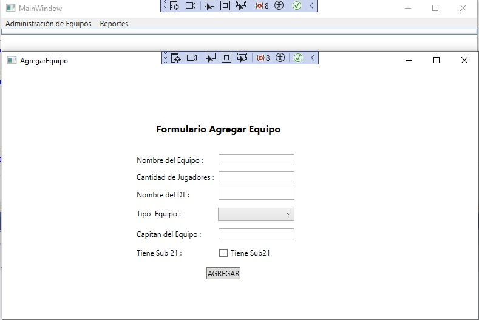

# Aplicación de Equipos de Fútbol - WPF

Esta es una aplicación de escritorio desarrollada en WPF (Windows Presentation Foundation) que permite gestionar equipos de fútbol. La aplicación permite a los usuarios agregar, actualizar, eliminar y visualizar equipos, con características de seguridad y encriptación de datos para proteger la información.

## Capturas de Pantalla

### Pantalla Principal

### Agregar Equipo

### Editar Equipo

## Características

- **Gestión de Equipos**: 
  - Agregar nuevos equipos.
  - Modificar información de equipos existentes.
  - Eliminar equipos de la base de datos.
  - Ver la lista de equipos registrados.

- **Encriptación y Desencriptación de Datos**:
  - La aplicación utiliza el algoritmo AES (Advanced Encryption Standard) para proteger la información sensible de los equipos, como los nombres de los equipos y otros datos importantes.

  ## Tecnologías utilizadas
  - .NET Framework 4.8
  - Entity Framework 6.1
  - Linq.
  - Patrón Arquitectura MVVM.
  - AES para encriptación.
  - SQL Server

   ## Licencia
   Este proyecto está licenciado bajo la licencia MIT.

